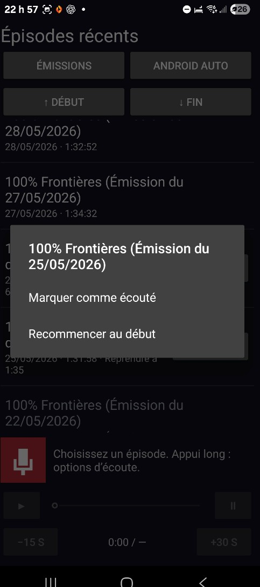
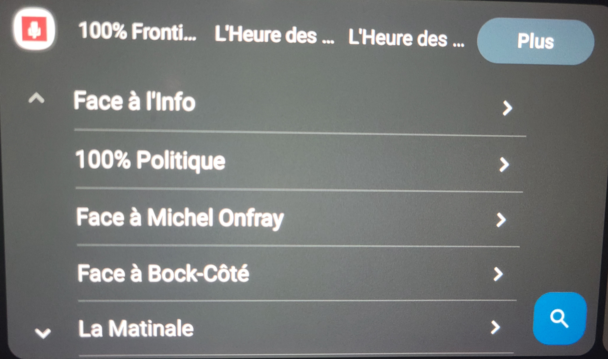
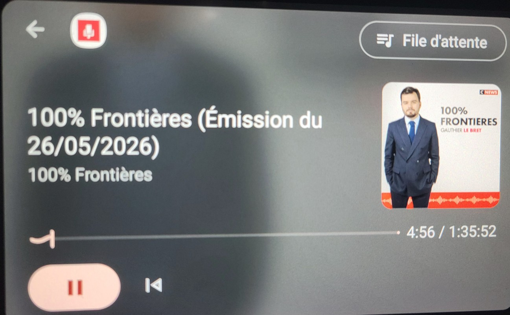
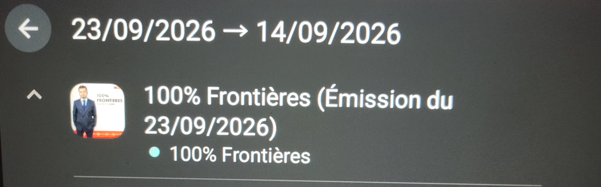

# 🎙️ CNEWS Podcast pour Android & Android Auto

Cette application personnelle, développée en **Kotlin**, permet d'écouter simplement les podcasts de **CNEWS** depuis un téléphone Android et **Android Auto**.

## 💡 Pourquoi cette application ?

Le projet est né d'une frustration toute simple : je voulais pouvoir écouter les podcasts de la chaîne en voiture, mais il n'existait pas d'application Android Auto répondant à ce besoin.

Pour lancer un podcast, je devais prendre mon téléphone, ouvrir l'application, sélectionner une thématique, rechercher le podcast puis démarrer la lecture. Autant de manipulations que je trouvais peu pratiques et surtout **inadaptées à une utilisation en voiture**.

J'ai donc décidé de créer ma propre application avec un objectif simple :

> **Accéder rapidement aux podcasts et les écouter depuis Android Auto avec un minimum d'interactions.**

Grâce aux possibilités offertes aujourd'hui par **l'IA générative et ChatGPT**, j'ai pu transformer ce besoin personnel en une véritable application Android, alors que développer seul un tel projet aurait été beaucoup plus difficile pour moi il y a encore quelques années.

## 📱 Distribution

L'application est proposée **gratuitement** sous licence **GNU GPL v3.0 (GPL-3.0)** et n'est pas distribuée sur le Google Play Store.

➡️ **[Télécharger la dernière version](https://github.com/tocri/Cnews_podcast_app/releases/latest)** (CNEWSAUTO.apk)

## ⚠️ Avertissement

> **Projet indépendant et non officiel.**
>
> CNEWS n'est ni associé, ni affilié, ni impliqué dans le développement de cette application.
> Les marques, noms et contenus associés à CNEWS restent la propriété de leurs détenteurs respectifs.

---

# 📥 Installation

## Installation sur Android

1. Télécharger le fichier **APK** depuis la [dernière version disponible](https://github.com/tocri/Cnews_podcast_app/releases/latest).
2. Ouvrir le fichier `.apk` depuis le téléphone.
3. Android peut demander d'autoriser l'installation d'applications provenant de cette source.
4. Autoriser temporairement cette source si nécessaire.
5. Confirmer l'installation.

> ℹ️ Il n'est pas nécessaire d'activer les options pour développeurs d'Android pour installer l'APK.

## 🚗 Activation dans Android Auto

L'application étant installée en dehors du Google Play Store, une configuration supplémentaire d'Android Auto peut être nécessaire.

1. Sur le téléphone, ouvrir **Paramètres** et rechercher **Android Auto**.
2. Ouvrir les paramètres d'Android Auto.
3. Descendre jusqu'aux informations de version.
4. Appuyer plusieurs fois sur **Version** jusqu'à l'activation du mode développeur d'Android Auto.
5. Ouvrir le menu **⋮** en haut à droite.
6. Sélectionner **Paramètres pour développeurs**.
7. Activer **Sources inconnues**.
8. Reconnecter le téléphone au véhicule.

> ⚠️ Le mode développeur d'Android Auto est différent des options pour développeurs générales d'Android.

---

# ✨ Fonctionnalités

L'application propose deux interfaces :

- une **application Android** volontairement simple ;
- une interface spécialement conçue pour **Android Auto**.

## Fonctionnalités communes

- 🎙️ Classement des podcasts par thématique.
- ⏫ Accès rapide au début ou à la fin d'une liste de podcasts.
- ▶️ **Reprise automatique de la lecture** : un podcast reprend là où il a été interrompu, même après une déconnexion d'Android Auto.
- 🗺️ Gestion du **focus audio** : la lecture se met automatiquement en pause lorsqu'une autre application, comme un GPS, prend la parole, puis reprend ensuite.
- 🔄 Synchronisation de l'état des podcasts entre l'application Android et Android Auto.

## Sur le téléphone

- Possibilité de marquer manuellement un podcast comme **écouté** en effectuant un appui long sur celui-ci.
- Le statut est ensuite synchronisé avec Android Auto.

---

# 📸 Captures d'écran

| **Application mobile** | **Interface Android Auto** |
|:---:|:---:|
| <br><br> | <br><br><br><br><br><br><br><br> |

---

# 🛠️ Développer avec Visual Studio Code

Le [guide Visual Studio Code](docs/VISUAL-STUDIO-CODE.md) explique la préparation du SDK sans Android Studio, le clonage du dépôt, les fichiers à modifier, la compilation et l'installation de l'APK.

Une fois **Java 17** et le **SDK Android 35** configurés, ouvrir le dossier du projet dans VS Code et appuyer sur **Ctrl+Maj+B** pour lancer **Générer l'APK**.

La tâche **Vérifier le projet** lance les tests locaux et l'analyse Android.

Les tâches sont incluses dans `.vscode/tasks.json` ; aucune extension n'est indispensable à la compilation.

L'APK généré se trouve dans :

`app/build/outputs/apk/debug/app-debug.apk`

Le projet utilise :

- Gradle 8.13
- Android Gradle Plugin 8.10.1
- Kotlin 2.1.21
- Media3 1.8.0

Ces versions sont épinglées afin de garantir une compilation reproductible.

## 🚘 Tester Android Auto sans véhicule

Pour tester l'application avec un téléphone Android et le simulateur d'autoradio officiel :

[Desktop Head Unit](https://developer.android.com/training/cars/testing/dhu)

> Cette application est destinée à **Android Auto**. Il ne s'agit pas d'une application **Android Automotive OS** installée directement dans le système du véhicule.

---

# 🗂️ Structure du projet

```text
app/src/main/
  AndroidManifest.xml
      Permissions, service média et déclaration Android Auto

  assets/shows.json
      Registre des flux Acast vérifiés

  java/fr/perso/cnewsauto/
    RssParser.kt
        Titres, dates, GUID et enclosures HTTPS

    CatalogRepository.kt
        Réseau hors thread principal, cache mémoire et identifiants

    PlaybackService.kt
        MediaLibrarySession, ExoPlayer, focus audio et navigation Android Auto

    MainActivity.kt
        Interface du téléphone avec MediaBrowser

  res/xml/automotive_app_desc.xml
      Déclaration de la capacité média Android Auto

app/src/test/
  Tests RSS hors appareil

docs/SOURCES.md
  Analyse et registre des sources vérifiées
