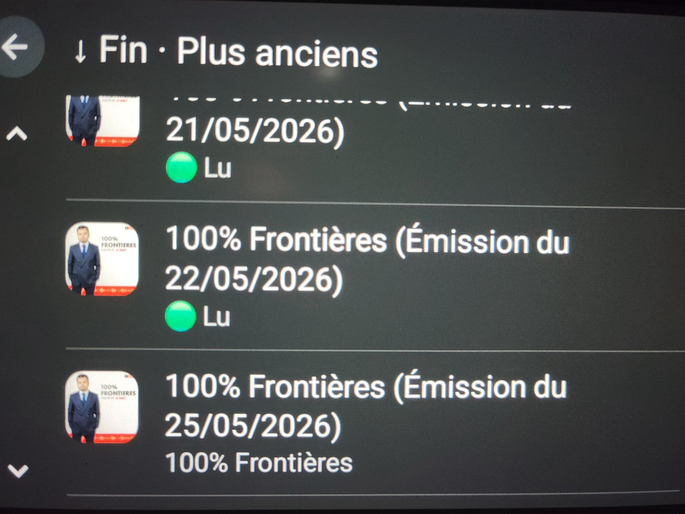
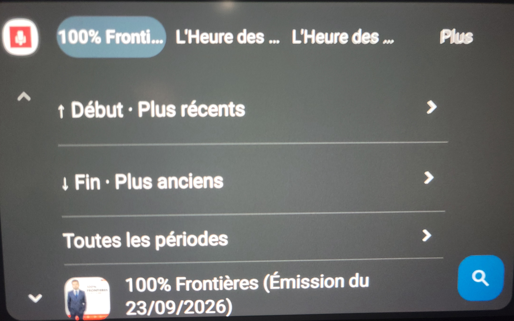

# 🎙️ CNEWS Podcast pour Android & Android Auto

Cette application personnelle, développée en **Kotlin**, permet d’écouter simplement les podcasts de **CNEWS** depuis un téléphone Android et **Android Auto**.

## 💡 Pourquoi cette application ?

Le projet est né d’une frustration toute simple : je voulais pouvoir écouter les podcasts de la chaîne en voiture, mais il n’existait pas d’application Android Auto répondant à ce besoin.

Pour lancer un podcast, je devais prendre mon téléphone, ouvrir l’application, sélectionner une thématique, rechercher le podcast puis démarrer la lecture. Autant de manipulations que je trouvais peu pratiques et surtout **inadaptées à une utilisation en voiture**.

J’ai donc décidé de créer ma propre application avec un objectif simple :

> **Accéder rapidement aux podcasts et les écouter depuis Android Auto avec un minimum d’interactions.**

Grâce aux possibilités offertes aujourd’hui par **l’IA générative et ChatGPT**, j’ai pu transformer ce besoin personnel en une véritable application Android, alors que développer seul un tel projet aurait été beaucoup plus difficile pour moi il y a encore quelques années.

## 📱 Distribution

L’application est proposée **gratuitement** et n’est pas distribuée sur le Google Play Store.

## ⚠️ Avertissement

> **Projet indépendant et non officiel.**
>
> CNEWS n’est ni associé, ni affilié, ni impliqué dans le développement de cette application. Les marques, noms et contenus associés à CNEWS restent la propriété de leurs détenteurs respectifs.

## Installation sur Android

1. Télécharger l'archive zip [Release 0.4.1](https://github.com/tocri/Cnews_podcast_app/releases/tag/0.41)
2. Décompresser l'archive afin d'obtenir le .apk
3. Copier l'apk dans votre android
4. Ouvrir l'apk à partir de votre téléphone.

Un message d'avertissement va apparaître. Il suffit de continuer

## Installation sur Android auto

1. Sur votre téléphone, aller dans Paramètres et chercher Android Auto (🔎).
2. Tout en bas, appuyer 10 fois sur version pour activer les paramètres développeur.
3. Ouvrir le menu ⋮ en haut à droite d'Android Auto.
4. Aller dans Paramètres pour développeurs.
5. Activer Sources inconnues.
6. Reconnecter Android Auto à la voiture

## Fonctionnalités

Il existe 2 versions de l'application. L'application sur le téléphone qui est assez rudimentaire du point de vue graphique et l'application Android Auto.

Fonctionnalités communes :

* Les podcast sont listés par thématique
* Possible d'atteindre le haut ou le bas de la liste des podcast en 1 clic
* Fonction de resume. Le podcast reprend là où il s'est arrêté même après une déconnexion d'android auto
* Le podcast se met en pause lorsqu'une autre application prend la parole (type logiciel GPS) et reprend quand c'est terminé

Sur le téléphone :

* Possible de marquer un podcast comme lu en laissant le doigt sur le podcast - important car cela permet de synchroniser le statut sur Android Auto


## Images

## 📸 Captures d'écran

| Application Android | Android Auto |
|:---:|:---:|
|  |   |


|  |  |
| **Application mobile** | **Interface Android Auto** |


 


## Développer avec Visual Studio Code

Le [guide Visual Studio Code](docs/VISUAL-STUDIO-CODE.md) explique la préparation du SDK sans Android Studio, le clonage du dépôt, les fichiers à modifier, la compilation et l’installation de l’APK.

Une fois Java 17 et le SDK Android 35 configurés, ouvrir le dossier du projet dans VS Code et appuyer sur **Ctrl+Maj+B** pour lancer **Générer l’APK**. La tâche **Vérifier le projet** lance les tests locaux et l’analyse Android. Les tâches sont incluses dans `.vscode/tasks.json` ; aucune extension n’est indispensable à la compilation.

Le fichier produit est `app/build/outputs/apk/debug/app-debug.apk`. Le projet utilise Gradle 8.13, Android Gradle Plugin 8.10.1, Kotlin 2.1.21 et Media3 1.8.0. Ces versions sont épinglées pour reproduire la compilation.

## Installer l’APK sur un téléphone, sans ADB

L’application exige Android 8 minimum ; Android Auto a ses propres exigences de compatibilité. Pour utiliser l’application, il n’est pas nécessaire de compiler le projet : récupérer l’APK fourni.

1. Transférer le fichier `.apk` sur le téléphone, par exemple par transfert de fichiers USB ou via un stockage partagé.
2. Sur le Samsung, ouvrir **Mes fichiers**, puis le dossier contenant l’APK (souvent **Téléchargements**).
3. Toucher l’APK et autoriser l’installation depuis cette application si Android le demande.
4. Choisir **Installer** ou **Mettre à jour**, puis ouvrir **Podcasts CNEWS · Perso**.

Aucun débogage USB/Wi-Fi ni ADB n’est nécessaire. Pour une mise à jour, conserver l’application existante : un APK signé avec la même clé préserve l’historique. Ne pas la désinstaller si Android signale une signature incompatible ; utiliser un APK signé avec la clé d’origine. Les clés de signature restent privées et sont exclues du dépôt.

Vérifier un épisode avec Internet. Les médias sont lus en streaming ; le forfait de données et les éventuelles publicités du flux Acast s’appliquent. Une liste déjà chargée peut rester visible sans réseau, mais l’audio n’est pas disponible hors connexion.

## Faire apparaître l’application dans Android Auto

1. Ouvrir les paramètres Android Auto du téléphone.
2. En bas, ouvrir les informations de version, puis toucher dix fois la zone version/informations pour activer le mode développeur.
3. Dans le menu à trois points, ouvrir les paramètres développeur et cocher **Sources inconnues**. Cette option Android Auto est distincte de l’autorisation Android d’installer un APK.
4. Vérifier la présence de « Podcasts CNEWS · Perso » dans la personnalisation du lanceur Android Auto, puis reconnecter le téléphone à la voiture.
5. Choisir l’émission puis l’épisode depuis l’écran de la voiture.

Google documente cette exception pour les applications média installées personnellement : [tests Android Auto](https://developer.android.com/training/cars/testing). Les libellés peuvent varier suivant le téléphone. Aucun compte développeur Play n’est nécessaire à cette méthode.

Pour tester au bureau avec un téléphone Android et le simulateur d’autoradio officiel : [Desktop Head Unit](https://developer.android.com/training/cars/testing/dhu). Il ne s’agit pas d’une application Android Automotive OS à installer directement dans un véhicule.

## Validation sur téléphone et autoradio

Effectuer les manipulations de test à l’arrêt.

| Scénario | Résultat attendu |
|---|---|
| Lancer depuis Android Auto avant d’ouvrir l’interface téléphone | Catalogue disponible sans connexion à un compte |
| Choisir 100 % Frontières puis le dernier épisode | Lecture en streaming sans confirmation ni écran intermédiaire ajouté par l’application |
| Éteindre l’écran du téléphone | Lecture et commandes de notification/autoradio maintenues |
| Déclencher une instruction Maps/Waze | Pause pendant la perte temporaire de focus, reprise après restitution |
| Faire pause soi-même pendant l’interruption | Aucune reprise automatique après l’instruction |
| Une autre application prend définitivement le focus | Pas de reprise automatique intempestive |
| Débrancher le casque ou perdre la sortie audio | Pause ; vérifier aussi la déconnexion Android Auto sur le véhicule utilisé |
| Couper puis rétablir Internet | Erreur compréhensible et possibilité de relancer la lecture |
| Revenir après plus de cinq minutes | RSS relu ; nouveaux épisodes visibles s’ils ont été publiés |
| Changer rapidement d’émission/épisode | Pas de liste d’une autre émission ni de lecture concurrente |

Le focus est géré par ExoPlayer avec `USAGE_MEDIA`, `CONTENT_TYPE_SPEECH` et gestion automatique activée. Media3 traite la perte temporaire autorisant le ducking comme une interruption de parole et reprend au gain de focus. Cela dépend d’une demande de focus effective par l’application GPS ; une instruction qui ne demande aucun focus ne peut pas être détectée de façon générale.

Une compilation et des tests JVM ne valident pas le comportement d’un autoradio réel : voir `VALIDATION.md` pour la distinction entre contrôles effectués et essais matériels restant à faire.

## Structure

```text
app/src/main/
  AndroidManifest.xml              Permissions, service média et déclaration Android Auto
  assets/shows.json                Registre des flux Acast vérifiés
  java/fr/perso/cnewsauto/
    RssParser.kt                   Titres, dates, GUID et enclosures HTTPS
    CatalogRepository.kt           Réseau hors thread principal, cache mémoire, identifiants
    PlaybackService.kt             MediaLibrarySession, ExoPlayer, focus et navigation Auto
    MainActivity.kt                Interface minimale du téléphone avec MediaBrowser
  res/xml/automotive_app_desc.xml   Capacité média Android Auto
app/src/test/                      Tests RSS hors appareil
docs/SOURCES.md                    Analyse et registre des sources vérifiées
```

Un unique lecteur appartient au service, jamais à l’écran du téléphone. Le navigateur téléphone et Android Auto utilisent la même session. Les identifiants d’épisodes dérivent du GUID RSS et non des URL signées. Le service résout les identifiants demandés vers les liens `enclosure` ; les redirections HTTP sont laissées au lecteur et ne sont pas enregistrées.

La recherche média accepte le nom d’une émission et propose son dernier épisode (jusqu’à trois émissions correspondantes). La transmission d’une commande vocale par l’assistant doit être vérifiée sur l’appareil ; aucune reconnaissance vocale propre à l’application n’est ajoutée.

Limites du MVP : pas de favoris, téléchargements ni historique chronologique. Les flux peuvent retirer d’anciens épisodes ; seuls les 60 récents sont exposés dans chaque émission. Les positions antérieures à la version 0.3.0 ne peuvent pas être reconstituées. Le catalogue n’inclut pas automatiquement toutes les émissions de la chaîne.
